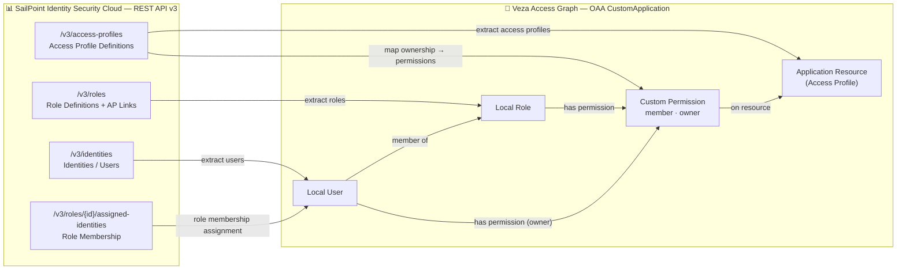

# SailPoint Identity Security Cloud → Veza OAA Integration

## 1. Overview

This integration collects identity, role, and access-profile data from **SailPoint Identity Security Cloud (ISC)** and pushes it into the **Veza Access Graph** via the Open Authorization API (OAA).

Once loaded, Veza can answer questions such as:
- Which identities (users) are assigned to which roles in SailPoint?
- Which roles grant access to which access profiles (permission bundles)?
- Who owns each access profile?
- Which users are inactive or managed?

### Entity Model

| SailPoint Entity | Veza OAA Entity | Details |
|---|---|---|
| Identity | **Local User** | `unique_id` = SailPoint identity ID; `email` linked to Veza identity provider |
| Role | **Local Role** | `unique_id` = SailPoint role ID |
| Access Profile | **Application Resource** (`resource_type=access_profile`) | Each access profile is a resource |
| Identity → Role assignment | `user.add_role()` | From `GET /v3/roles/{id}/assigned-identities` |
| Role → Access Profile link | `resource.add_permission("member", local_roles=[...])` | From `accessProfiles[]` on each role |
| Access Profile owner | `resource.add_permission("owner", identities=[...])` | From `owner.id` on each access profile |

### OAA Permission Mapping

| Custom Permission | OAA Canonical Permissions | Meaning |
|---|---|---|
| `member` | `DataRead` | A role (or user via that role) has access to this access profile |
| `owner` | `DataRead`, `DataWrite`, `MetadataRead`, `MetadataWrite` | Identity that owns/manages this access profile |

### Data Flow

```
SailPoint ISC (v3 API)
  ├─ GET /v3/identities                   → Local Users
  ├─ GET /v3/roles                        → Local Roles + access-profile membership
  ├─ GET /v3/roles/{id}/assigned-identities → User → Role assignments
  └─ GET /v3/access-profiles              → Application Resources
                                                    ↓
                                           OAA CustomApplication payload
                                                    ↓
                                              Veza Access Graph
```

---

## 2. Entity Relationship Map



---

## 3. How It Works

1. **Authenticate** — obtain a short-lived JWT from `POST /oauth/token` using the OAuth2 Client Credentials grant (PAT `client_id` + `client_secret`).
2. **Collect identities** — paginate `GET /v3/identities` (250 per page) to build the user list with name, email, manager, and lifecycle state.
3. **Collect roles** — paginate `GET /v3/roles` to get all role definitions including their embedded `accessProfiles[]` lists.
4. **Collect role assignments** — for each role, paginate `GET /v3/roles/{id}/assigned-identities` to map which identities hold that role.
5. **Collect access profiles** — paginate `GET /v3/access-profiles` to get all access profiles with their source, owner, and entitlement counts.
6. **Build OAA payload** — construct a `CustomApplication` object:
   - Add identities as Local Users (with email linked to Veza identity graph).
   - Add roles as Local Roles.
   - Assign users to roles via `user.add_role()`.
   - Add access profiles as Application Resources.
   - Grant `member` permission on each resource to the roles that contain it.
   - Grant `owner` permission to the identity that owns each access profile.
7. **Push to Veza** — call `OAAClient.push_application()` with `create_provider=True`.

---

## 4. Prerequisites

| Requirement | Details |
|---|---|
| Python | 3.9+ |
| OS | Linux (RHEL 8/9, Amazon Linux 2023, Ubuntu 20.04/22.04) or macOS (dev only) |
| SailPoint ISC | Access to a tenant with `idn:access-profile:read`, `idn:role:read`, `idn:identity:read` scopes |
| SailPoint PAT | A Personal Access Token with `CLIENT_CREDENTIALS` grant type |
| Veza | A Veza tenant and an API key with OAA write permissions |
| Network | HTTPS (443) outbound to `<tenant>.api.identitynow.com` and your Veza tenant |

### Generate a SailPoint Personal Access Token

1. Log in to your SailPoint ISC instance.
2. Click your username → **Preferences** → **Personal Access Tokens**.
3. Click **New Token**, give it a meaningful name (e.g. `veza-oaa-integration`).
4. Click **Create Token** and **copy both the Client ID and Client Secret** — the secret is only shown once.
5. The PAT automatically uses the `CLIENT_CREDENTIALS` grant type.

---

## 5. Quick Start

```bash
curl -fsSL https://raw.githubusercontent.com/YOUR_ORG/YOUR_REPO/main/integrations/sailpoint/install_sailpoint.sh | bash
```

For non-interactive / CI install:

```bash
SAILPOINT_TENANT=mycompany \
SAILPOINT_CLIENT_ID=your_client_id \
SAILPOINT_CLIENT_SECRET=your_client_secret \
VEZA_URL=https://myorg.veza.com \
VEZA_API_KEY=your_veza_api_key \
bash install_sailpoint.sh --non-interactive
```

---

## 6. Manual Installation

### RHEL 8/9 / Amazon Linux 2023

```bash
# Install system dependencies
sudo dnf install -y python3 python3-pip git

# Clone repository
git clone https://github.com/YOUR_ORG/YOUR_REPO.git
cd YOUR_REPO/integrations/sailpoint

# Create virtual environment
python3 -m venv venv
source venv/bin/activate

# Install Python dependencies
pip install -r requirements.txt

# Configure credentials
cp .env.example .env
chmod 600 .env
vi .env  # fill in real values

# Test connectivity
./preflight_sailpoint.sh --all

# Dry-run
python3 sailpoint.py --env-file .env --dry-run --save-json
```

### Ubuntu 20.04 / 22.04

```bash
sudo apt-get update && sudo apt-get install -y python3 python3-pip python3-venv git

git clone https://github.com/YOUR_ORG/YOUR_REPO.git
cd YOUR_REPO/integrations/sailpoint

python3 -m venv venv
source venv/bin/activate
pip install -r requirements.txt

cp .env.example .env && chmod 600 .env
vi .env

./preflight_sailpoint.sh --all
python3 sailpoint.py --env-file .env --dry-run --save-json
```

### .env Configuration

```bash
SAILPOINT_TENANT=mycompany              # your ISC subdomain
SAILPOINT_CLIENT_ID=b61429f5-...        # PAT Client ID
SAILPOINT_CLIENT_SECRET=c924417c...     # PAT Client Secret
VEZA_URL=https://myorg.veza.com
VEZA_API_KEY=your_veza_api_key_here
```

---

## 7. Usage

```bash
python3 sailpoint.py [options]
```

| Argument | Required | Default | Description |
|---|---|---|---|
| `--sailpoint-tenant TENANT` | Yes* | `SAILPOINT_TENANT` env | SailPoint tenant name (e.g. `mycompany`) |
| `--sailpoint-url URL` | No | derived from tenant | Full API base URL override |
| `--sailpoint-client-id CLIENT_ID` | Yes* | `SAILPOINT_CLIENT_ID` env | OAuth2 PAT Client ID |
| `--sailpoint-client-secret SECRET` | Yes* | `SAILPOINT_CLIENT_SECRET` env | OAuth2 PAT Client Secret |
| `--veza-url URL` | Yes* | `VEZA_URL` env | Veza tenant URL |
| `--veza-api-key KEY` | Yes* | `VEZA_API_KEY` env | Veza API key |
| `--provider-name NAME` | No | `SailPoint` | Provider name in Veza UI |
| `--datasource-name NAME` | No | tenant name | Datasource name in Veza UI |
| `--env-file PATH` | No | `.env` | Path to .env credentials file |
| `--dry-run` | No | false | Build payload without pushing to Veza |
| `--save-json` | No | false | Save OAA JSON payload to disk for inspection |
| `--log-level LEVEL` | No | `INFO` | Verbosity: `DEBUG`, `INFO`, `WARNING`, `ERROR` |

*Required unless provided via environment variable or `.env` file.

### Examples

```bash
# Dry-run (no Veza push), save JSON payload
python3 sailpoint.py --env-file .env --dry-run --save-json

# Full run — push to Veza
python3 sailpoint.py --env-file .env

# Debug verbosity
python3 sailpoint.py --env-file .env --log-level DEBUG

# Override provider/datasource names
python3 sailpoint.py --env-file .env \
    --provider-name "SailPoint ISC" \
    --datasource-name "sailpoint-production"

# Supply credentials entirely via CLI (no .env file)
python3 sailpoint.py \
    --sailpoint-tenant mycompany \
    --sailpoint-client-id b61429f5-... \
    --sailpoint-client-secret c924417c... \
    --veza-url https://myorg.veza.com \
    --veza-api-key your_key \
    --dry-run
```

---

## 8. Deployment on Linux

### Create a dedicated service account

```bash
sudo useradd -r -s /bin/bash -m -d /opt/sailpoint-veza sailpoint-veza
sudo mkdir -p /opt/VEZA/sailpoint-veza/scripts /opt/VEZA/sailpoint-veza/logs
sudo chown -R sailpoint-veza:sailpoint-veza /opt/VEZA/sailpoint-veza
sudo chmod 700 /opt/VEZA/sailpoint-veza/scripts
sudo chmod 600 /opt/VEZA/sailpoint-veza/scripts/.env
```

### SELinux (RHEL / Amazon Linux)

```bash
# Check SELinux status
getenforce

# If Enforcing, restore context after copying files
sudo restorecon -Rv /opt/VEZA/sailpoint-veza/
```

### Cron wrapper script

Create `/opt/VEZA/sailpoint-veza/run_sailpoint.sh`:

```bash
#!/usr/bin/env bash
set -euo pipefail
cd /opt/VEZA/sailpoint-veza/scripts
./venv/bin/python3 sailpoint.py --env-file .env 2>&1
```

```bash
sudo chmod 750 /opt/VEZA/sailpoint-veza/run_sailpoint.sh
sudo chown sailpoint-veza:sailpoint-veza /opt/VEZA/sailpoint-veza/run_sailpoint.sh
```

### Schedule with cron (daily at 02:00)

```bash
sudo tee /etc/cron.d/sailpoint-veza >/dev/null <<'EOF'
# SailPoint → Veza OAA integration — daily at 02:00 UTC
0 2 * * * sailpoint-veza /opt/VEZA/sailpoint-veza/run_sailpoint.sh >> /opt/VEZA/sailpoint-veza/logs/cron.log 2>&1
EOF
sudo chmod 644 /etc/cron.d/sailpoint-veza
```

### Log rotation

Create `/etc/logrotate.d/sailpoint-veza`:

```
/opt/VEZA/sailpoint-veza/logs/*.log {
    daily
    rotate 30
    compress
    delaycompress
    missingok
    notifempty
    create 0640 sailpoint-veza sailpoint-veza
}
```

---

## 9. Multiple Instances

To run against multiple SailPoint tenants, create a separate `.env` file per tenant:

```bash
# Tenant A
python3 sailpoint.py --env-file .env.tenant-a --datasource-name sailpoint-tenant-a

# Tenant B
python3 sailpoint.py --env-file .env.tenant-b --datasource-name sailpoint-tenant-b
```

Stagger cron jobs by 30 minutes to avoid simultaneous Veza push conflicts:

```
0 2 * * *  sailpoint-veza .../sailpoint.py --env-file .env.tenant-a
30 2 * * * sailpoint-veza .../sailpoint.py --env-file .env.tenant-b
```

---

## 10. Security Considerations

- **`.env` file permissions** — always `chmod 600 .env`; owned by the service account only.
- **PAT scope** — use a dedicated service account PAT with read-only scopes. Required scopes: `idn:identity:read`, `idn:role:read`, `idn:access-profile:read`.
- **PAT rotation** — SailPoint PATs do not expire by default, but rotate the Client Secret periodically and update `.env`.
- **Veza API key** — use a Veza service account key with OAA push permissions only.
- **SELinux / AppArmor** — run `restorecon` after deployment on RHEL/CentOS; create an AppArmor profile on Ubuntu if required by policy.
- **No credentials in logs** — the logging module is used throughout; credentials are never logged.
- **Network** — restrict outbound HTTPS to `*.api.identitynow.com` and `*.veza.com` at the firewall level.

---

## 11. Troubleshooting

### Authentication fails (`HTTP 401` on token request)

- Confirm `SAILPOINT_CLIENT_ID` and `SAILPOINT_CLIENT_SECRET` match the PAT shown in ISC → Preferences → Personal Access Tokens.
- Verify the PAT is enabled and has not been deleted (ISC limits 10 PATs per user).
- Ensure the `client_id` contains dashes (legacy `G6xLlBB...` format IDs will not work with OAuth2).

### `HTTP 403` on API calls

- The service account user that generated the PAT must have at minimum `ORG_ADMIN` or read-delegated access for identities, roles, and access profiles.
- A `403` from Veza means the Veza API key lacks OAA write permissions — regenerate with the correct role.

### `Connection refused` / `Name resolution failed`

- Verify `SAILPOINT_TENANT` exactly matches your ISC subdomain.
- Test: `curl -I https://<tenant>.api.identitynow.com/v3/access-profiles?limit=1`

### Missing Python packages

```bash
./venv/bin/pip install -r requirements.txt
```

### Veza push warnings

Warnings in the Veza response (logged at `WARNING` level) are non-fatal. Common causes:
- Identity email address not found in Veza's identity graph — the Local User is still created but not linked.
- Duplicate resource names — append a unique suffix or prefix with source name.

### Log location

```
./logs/sailpoint_DDMMYYYY-HHMM.log
```

Run with `--log-level DEBUG` for verbose output.

---

## 12. Changelog

| Version | Date | Notes |
|---|---|---|
| v1.0 | 2026-05-11 | Initial release — identities, roles, role assignments, access profiles |
